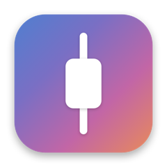
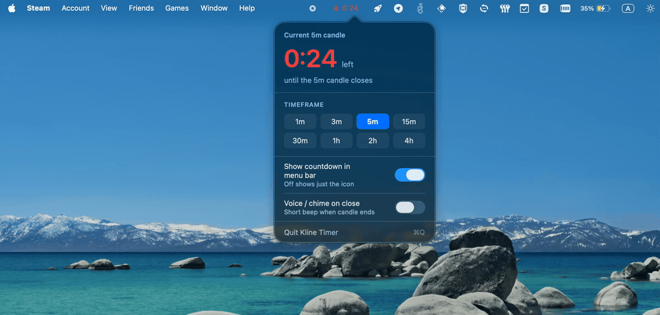
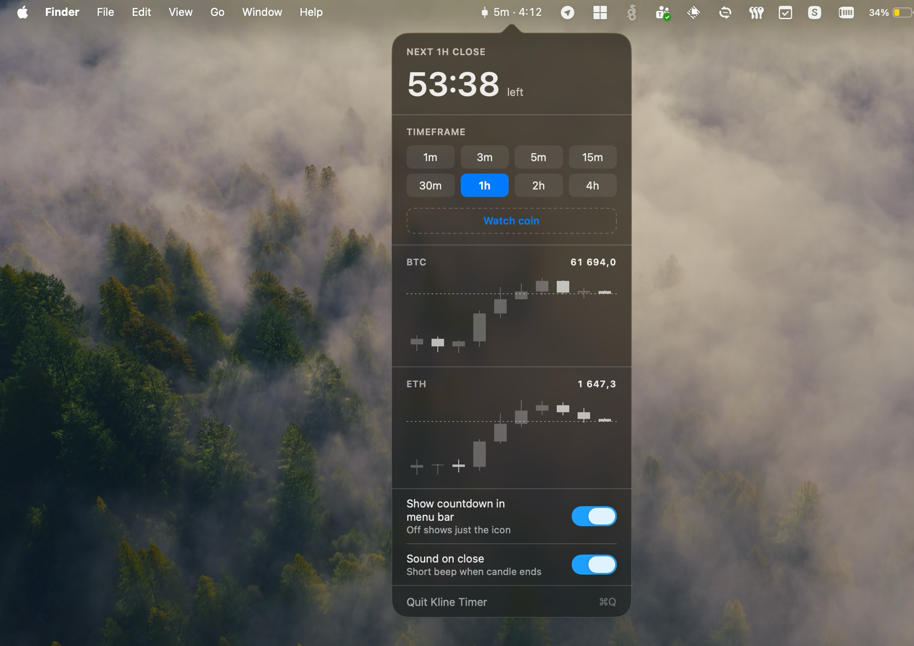

<p align="center">
  
</p>

# Kline Timer ⏰ — menu-bar countdown to the candle close

[](https://swift.org)
[](https://www.apple.com/macos)
[](https://github.com/asidko/kline-timer/releases)
[](https://github.com/asidko/kline-timer/actions/workflows/ci.yml)
[](LICENSE)

A light, native macOS menu-bar app that counts down the current trading candle and
restarts itself for the next one. Under a minute it turns red and shows the seconds.
Optionally, it charts a watchlist of live Binance coins right in the panel.

No Dock icon, no window — it lives in the menu bar. Pure Swift on AppKit + SwiftUI,
zero third-party dependencies.



## What's new in v1.2.0

- **Watch live coins** — add Binance pairs and see them in the panel.
- **Quick search** — find any coin by ticker or name.
- **Live charts** — candlestick and price update in real time.



## Install

**Install script** *(recommended).* Downloads the latest release and installs it to `/Applications`; append `-s -- --remove` to uninstall.

```sh
curl -fsSL https://raw.githubusercontent.com/asidko/kline-timer/main/install.sh | sh
```

**Homebrew.** Quarantines the app, so the first launch is blocked — approve it once under **System Settings → Privacy & Security → Open Anyway**.

```sh
brew install --cask asidko/tap/kline-timer
```

**Manual.** Download `KlineTimer.dmg` from [Releases](https://github.com/asidko/kline-timer/releases),
open it, and drag **Kline Timer** onto **Applications**.

Then click the candle icon in the menu bar, pick a timeframe, and trade your candle.

## Why

Scalpers and intraday traders live and die by the candle close — entries, exits, and
confirmation all hinge on *when this bar ends*. Reading that off a chart means keeping a
chart tab open and doing mental math against the wall clock. Kline Timer collapses that
to one glance at the menu bar: the exact seconds to close, on the timeframe you're trading.

## How it compares

- **A chart tab left open** — works, but it's a whole window and you still eyeball the close. Kline Timer is a glanceable line in the menu bar.
- **A generic countdown / Pomodoro timer** — counts down a fixed duration you set by hand. Kline Timer aligns to real exchange candle boundaries and auto-restarts every close, so you never reset it.

## Usage

Click the menu-bar item to open the panel: a live readout, the timeframe picker
(1m, 3m, 5m, 15m, 30m, 1h, 2h, 4h), the watchlist, two toggles, and Quit (⌘Q).

The menu-bar item has three states:

- **Ticking, time shown** — glyph plus timeframe and remaining, e.g. `5m · 3:24`. Default.
- **Ticking, time hidden** — just the glyph. Turn off *Show countdown in menu bar*.
- **Final minute** — when the countdown is shown, the last minute turns the glyph and seconds (`0:47`) red and pulses. Restarts automatically at zero.

## Configuration

There's no config file — preferences are set in the panel and persisted via macOS
`UserDefaults` (`com.kline.timer`):

- **Timeframe** — the candle interval to count down.
- **Watched coins** — Binance pairs charted in the panel (seeded with BTC on first run).
- **Show countdown in menu bar** — off leaves just the icon.
- **Sound on close** — a short system beep when a candle closes.

Candle boundaries align to UTC, exactly like exchange klines: 5m candles close at
:00/:05/:10, 4h candles at 00:00/04:00/08:00 UTC. The countdown is recomputed from the
wall clock every second, so it never drifts.

## Build from source

Requires Swift 5.9+ (Xcode or the Command Line Tools).

```sh
swift run            # build and launch the menu-bar app
swift test           # run the countdown unit tests
./bundle.sh          # build KlineTimer.app, then: open KlineTimer.app
```

### Architecture

Two targets enforce the layering:

- `Sources/KlineCore` — pure, exchange-agnostic domain: `Timeframe`, `CandleClock`
  (epoch-aligned remaining-seconds math and formatting), and the `Candle` value type.
  No AppKit, no network, fully unit-tested.
- `Sources/KlineTimer` — the app: `StatusItemController` (menu bar), `PopoverView`
  + `CandleChartView` + `CoinPickerView` (SwiftUI), `CoinMonitor`/`BinanceClient`/`CoinCatalog`
  (watchlist + Binance REST), `Settings`/`TimerModel` (state), `Chime`, wired by `AppDelegate`.

The UI never does candle math; the core never imports AppKit or talks to the network.
The one-second clock lives in `AppDelegate` and pushes computed values out to both the
status item and the panel; the watchlist polls Binance's public klines endpoint.

## Related

- **Binance Kline Scanner** 🔎 — screen Binance USD-M futures for fresh same-color candle impulses (CLI). [asidko/binance-kline-scanner](https://github.com/asidko/binance-kline-scanner)
- **Binance Futures Monitor** 🔔 — price-level alerts for Binance USD-M futures; one small binary, background daemon, alerts to Telegram/file/webhook/stdout (CLI). [asidko/binance-futures-monitor](https://github.com/asidko/binance-futures-monitor)

## License

[MIT](LICENSE) © Alexander Sidko
